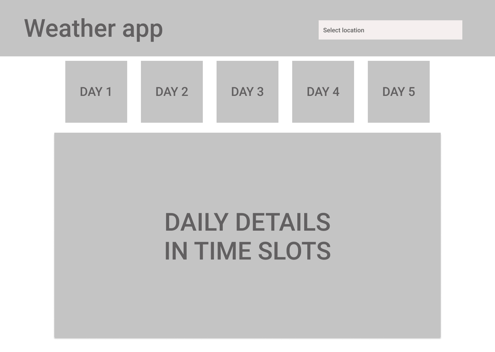

This project was bootstrapped with [Create React App](https://github.com/facebook/create-react-app).

# Weather App

Applicazione in React per la visualizzazione delle previsioni meteo settimanali di una località selezionata. I dati meteo sono presi da [Open Weather Api](https://openweathermap.org/api).

### Home page

Nella home page ci saranno delle card cliccabili con i giorni della settimana, e i dettagli per fascia oraria del giorno selezionato. In alto nella AppBar c'è la barra di ricerca della località.

